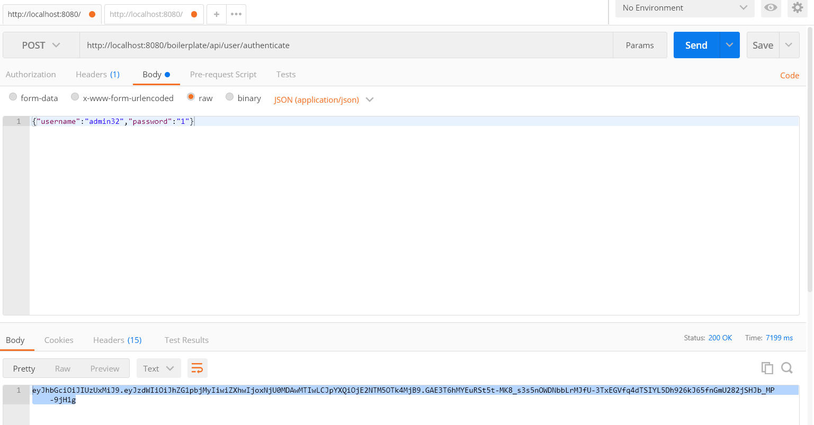
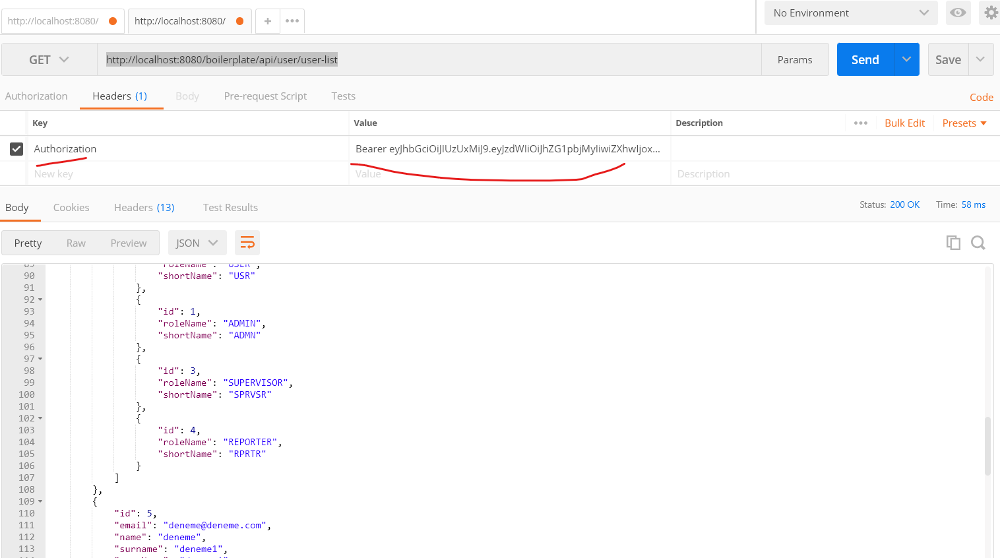

# SpringBoilerPlate

To get token you can post request to : http://localhost:8080/boilerplate/api/user/authenticate

Then you can use this token to get data from service.
http://localhost:8080/boilerplate/api/user/user-list

